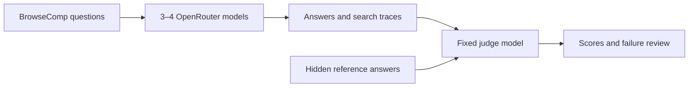

# BrowseComp Research Eval

This is a small learning project.

We will rebuild a simple version of the BrowseComp evaluation. The aim is to
learn how research models search the web and how their answers are scored.

We are not creating a new benchmark. We are using an existing benchmark to
learn how evaluation code works.

## What we will test

We will choose three or four models on OpenRouter.

Each model will receive the same BrowseComp questions. Each model will also
use the same search setup and the same tool budget. Only the model will change.

This lets us ask:

> Which model solves more BrowseComp questions under the same conditions?

## How it works



For each question:

1. Send the question to a model.
2. Let the model search the web.
3. Save its search trace and final answer.
4. Compare its answer with the hidden reference answer.
5. Mark the answer as correct or incorrect.

The model answering the question never sees the reference answer.

## Results (5 q x 4 models x 1 judge)

| Model | Completed | Correct | End-to-end | Searches | Cost |
|---|---:|---:|---:|---:|---:|
| Gemini 3.7 Flash | 5/5 | 4 | **80%** | 24 | **$0.25** |
| Grok 4.6 | 5/5 | 3 | **60%** | 53 | **$1.12** |
| Claude Sonnet 5 | 5/5 | 2 | **40%** | 48 | **$1.96** |
| DeepSeek V4 Flash | 4/5 | 2 | **40%** | 44 | **$0.31** |
| Luna judge | 19/19 | — | — | — | **$0.004** |


For 10q + want to try:

```
[
  "google/gemini-3.7-flash",
  "x-ai/grok-4.6",
  "deepseek/deepseek-v4-flash-0731"
]
```

## Scoring

A separate judge model checks whether the model's answer means the same thing
as the reference answer.

A correct answer gets 1 point. An incorrect answer gets 0 points.

```text
accuracy = correct answers / all attempted questions
```

We will use the same judge for every model.

## What we will build

We will start small:

1. Load a BrowseComp question.
2. Run one model through OpenRouter.
3. Save the answer and search trace.
4. Grade the answer.
5. Repeat this with several models.
6. Compare the results and read the failures.

We will first test about five questions. If the code works, we can run 20–50
questions. There is no reason to run all 1,266 questions while we are still
learning and fixing the code.

## Tools

We will use Python, `uv`, OpenRouter, and JSON files.

Docker is not needed.

## Run it

Set up the environment:

```bash
uv sync
cp .env.example .env
```

Add your OpenRouter key to `.env`, then load it into the terminal:

```bash
set -a
source .env
set +a
```

Check the dataset and experiment config:

```bash
uv run python main.py check
```

Show the five fixed smoke-test questions without their reference answers:

```bash
uv run python main.py sample --count 5 --seed 0
```

The candidate models, judge, and search budget are recorded in
`experiment.json`. A live run still requires `OPENROUTER_API_KEY`.

Run the five-question experiment:

```bash
uv run python main.py run
```

Each model gets the same Exa search tool and a five-step server-tool limit.
OpenRouter may execute more than one search inside a step, so the saved trace
records the actual number of searches and the actual cost.

## Main lesson

The score is only one part of the experiment. We also want to understand why a
model failed. The problem may come from its search, reasoning, final answer,
the judge, or our own code.

The project is successful when we understand this full path:

```text
question -> search -> answer -> judge -> score
```

The original benchmark is described in the
[BrowseComp paper](https://arxiv.org/pdf/2504.12516). Its grading code is in
[OpenAI simple-evals](https://github.com/openai/simple-evals/blob/main/browsecomp_eval.py).
